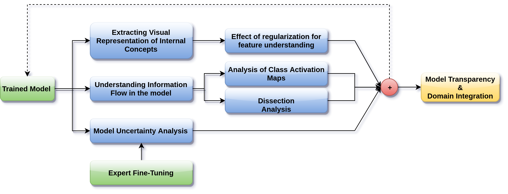
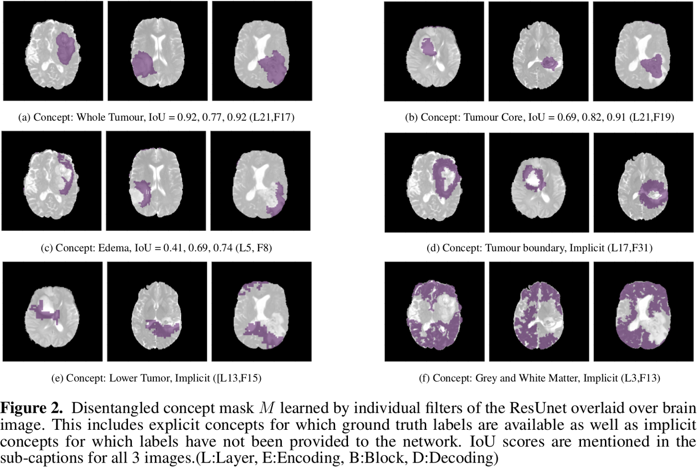
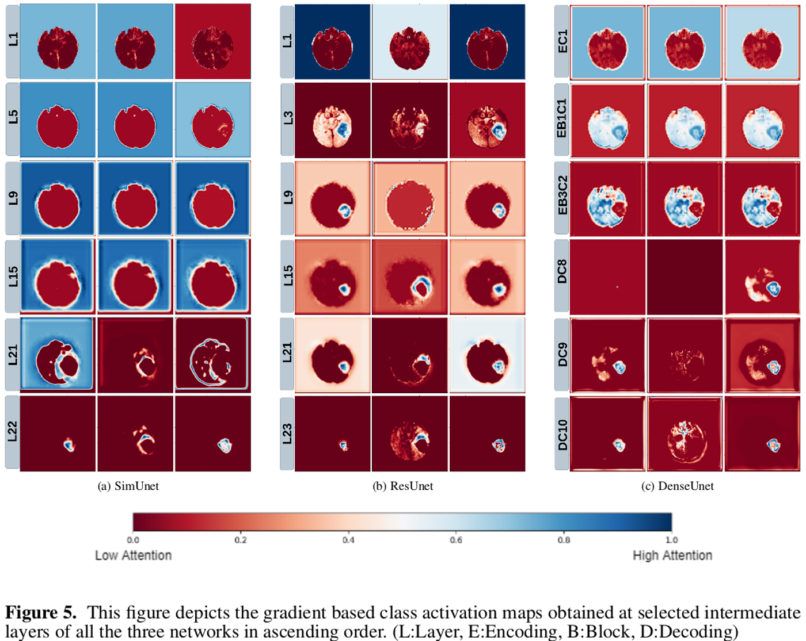
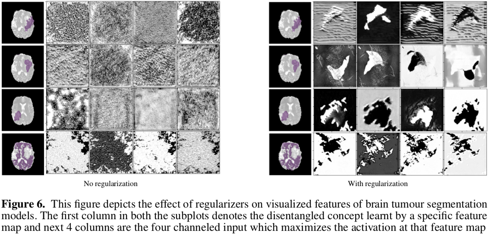
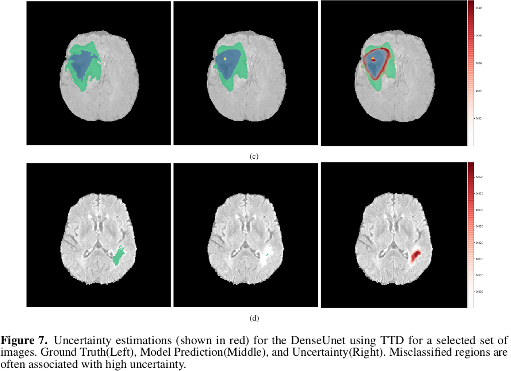
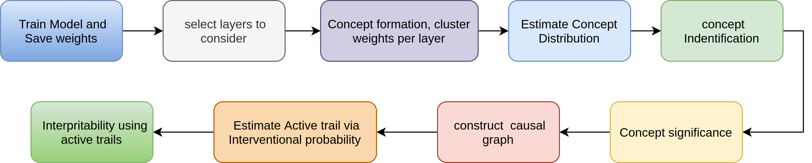

# BioExp
[](https://travis-ci.org/koriavinash1/BioExp)
[](https://bioexp.readthedocs.io/en/latest/?badge=latest)
[](https://badge.fury.io/py/BioExp)
[](https://opensource.org/licenses/MIT)

Explaining Deep Learning Models which perform various image processing tasks in the medical images and natural images.

# Features

- [x] Dissection Analysis
- [x] Ablation Analysis
- [x] Uncertainity Analysis
   - [x] Epistemic Uncertainty using Bayesian Dropout
   - [x] Aleatoric Uncertainty using Test Time Augmentation
- [x] Activation Maximization
- [x] CAM Analysis
- [x] RCT on input and concept space 
- [x] Concept generation clustering analysis
   - [x] wts based clustering
   - [x] feature based clustering
- [x] Concept Identification
  - [x] Dissection based
  - [x] Flow based
- [x] Causal Graph 
- [ ] Inference Methods
- [ ] Counterfactual Generation
- [ ] Ante-hoc methods

# Citations
If you use BioExp, please cite our work:

```
@article{natekar2019demystifying,
  title={Demystifying Brain Tumour Segmentation Networks: Interpretability and Uncertainty Analysis},
  author={Natekar, Parth and Kori, Avinash and Krishnamurthi, Ganapathy},
  journal={arXiv preprint arXiv:1909.01498},
  year={2019}
}
```

# Defined Pipeline


# Installation
Running of the explainability pipeline requires a GPU and several deep learning modules. 

### Requirements
- 'pandas'
- 'numpy'
- 'scipy==1.6.0'
- 'matplotlib'
- 'pillow'
- 'simpleITK'
- 'opencv-python'
- 'tensorflow-gpu==1.14'
- 'keras'
- 'keras-vis'
- 'lucid'

The following command will install only the dependencies listed above.

```
pip install BioExp
```

# Ablation

## Usage
```
from BioExp.spatial import Ablation

A = spatial.Ablation(model = model, 
				weights_pth = weights_path, 
				metric      = dice_label_coef, 
				layer_name  = layer_name, 
				test_image  = test_image, 
				gt 	    = gt, 
				classes     = infoclasses, 
				nclasses    = 4)

df = A.ablate_filter(step = 1)
```

# Dissection

## Usage
```
from BioExp.spatial import Dissector

layer_name = 'conv2d_3'
infoclasses = {}
for i in range(1): infoclasses['class_'+str(i)] = (i,)
infoclasses['whole'] = (1,2,3)

dissector = Dissector(model=model,
                        layer_name = layer_name)

threshold_maps = dissector.get_threshold_maps(dataset_path = data_root_path,
                                                save_path  = savepath,
                                                percentile = 85)
dissector.apply_threshold(image, threshold_maps, 
                        nfeatures =9, 
                        save_path = savepath, 
                        ROI       = ROI)

dissector.quantify_gt_features(image, gt, 
                        threshold_maps, 
                        nclasses   = infoclass, 
                        nfeatures  = 9, 
                        save_path  = savepath,
                        save_fmaps = False, 
                        ROI        = ROI)
```
## Results




# GradCAM

## Usage
```
from BioExp.spatial import cam

dice = flow.cam(model, img, gt, 
				nclasses = nclasses, 
				save_path = save_path, 
				layer_idx = -1, 
				threshol = 0.5,
				modifier = 'guided')

```
## Results



# Activation Maximization

## Usage
```
from BioExp.concept.feature import Feature_Visualizer

class Load_Model(Model):

  model_path = '../../saved_models/model_flair_scaled/model.pb'
  image_shape = [None, 1, 240, 240]
  image_value_range = (0, 10)
  input_name = 'input_1'

E = Feature_Visualizer(Load_Model, savepath = '../results/', regularizer_params={'L1':1e-3, 'rotate':8})
a = E.run(layer = 'conv2d_17', class_ = 'None', channel = 95, transforms=True)

```

##Activation Results



# Uncertainty

## Usage
```
from BioExp.uncertainty import uncertainty

D = uncertainty(test_image)
            
# for aleatoric
mean, var = D.aleatoric(model, iterations = 50)

# for epistemic
mean, var = D.epistemic(model, iterations = 50)
 
# for combined
mean, var = D.combined(model, iterations = 50)

```
## Results



# Radiomics
## Usage
```
from BioExp.helpers import radfeatures
feat_extractor = radfeatures.ExtractRadiomicFeatures(image, mask, save_path = pth)
df = feat_extractor.all_features()
```

# Causal Inference Pipeline


# Contact
- Avinash Kori (koriavinash1@gmail.com)
- Parth Natekar (parth@smail.iitm.ac.in)
